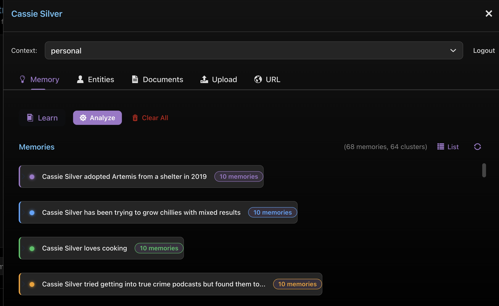

# Embabel Vaadin Components

Shared [Vaadin Flow](https://vaadin.com/flow) UI components for building Embabel agent applications with semantic memory and chat capabilities. These components power the UI of applications built on the [Embabel Agent Framework](https://embabel.com) and [DICE](https://github.com/embabel/dice) semantic memory system.

## Screenshots

### Chat Interface

The `ChatMessageBubble` component renders user and assistant messages with full markdown support. The `UserSection` displays the current user as an avatar chip. The `Footer` provides consistent branding.


*An Embabel agent using memories to answer questions about the user's pets. Note how the assistant recalls specific details ("You have a cat called Artemis") from previously extracted memories.*

### Memory Management

The `MemorySection`, `PropositionsPanel`, and `PropositionCard` components provide a full knowledge management interface with cluster analysis.



*The Memory tab showing 68 extracted memories organized into 64 clusters. Each cluster groups semantically similar propositions with color-coded indicators. Buttons allow learning from documents, analyzing conversations, and clearing memories.*

## Components

### Chat

| Component | Description |
|-----------|-------------|
| `ChatMessageBubble` | Message bubble with sender label. User messages render as plain text (accent-colored, right-aligned). Assistant messages render markdown via CommonMark (left-aligned). Factory methods: `user()`, `assistant()`, `error()`. |
| `VoiceControl` | Microphone and speaker buttons using the Web Speech API. Records audio and sends to server for OpenAI Whisper transcription (falls back to browser speech recognition). Speaker button toggles auto-speak of assistant responses via server-side TTS with browser fallback. |

### Memory & Knowledge

| Component | Description |
|-----------|-------------|
| `MemorySection` | Top-level memory management container. Provides **Learn** (file upload), **Analyze** (trigger extraction), and **Clear All** (with confirmation dialog) actions. Tracks upload progress and delegates display to `PropositionsPanel`. |
| `PropositionsPanel` | Displays extracted propositions (memories) in two switchable views: a **flat list** sorted by creation time, or a **cluster view** that groups semantically similar propositions with similarity scores. |
| `PropositionCard` | Individual memory card showing proposition text, confidence percentage (color-coded: green/yellow/red), creation timestamp, entity mention badges, and a delete button. Clicking an entity badge opens a dialog with `EntityPanel`. |

### Entities

| Component | Description |
|-----------|-------------|
| `EntitiesSection` | Scrollable list of all named entities for the current context. Loads from `NamedEntityDataRepository`, displays entity count, and supports refresh. |
| `EntityPanel` | Card for a single resolved entity showing type badge, name, description, and ID. Used standalone and in dialogs opened from `PropositionCard`. |

### Agent Platform

| Component | Description |
|-----------|-------------|
| `AgentsSection` | Displays registered agents as expandable cards. Collapsed view shows agent name, provider badge, and action/goal counts. Expanding reveals the agent's description and its actions and goals rendered inline using `ActionsSection.createActionCard()` and `GoalsSection.createGoalCard()`. Uses Vaadin `Details` for click-to-expand. |
| `ActionsSection` | Displays registered actions. Each card shows action name, description, input/output type badges with arrow notation, and flags (rerunnable, read-only). `createActionCard()` is public static for reuse by `AgentsSection`. |
| `GoalsSection` | Displays registered goals. Each card shows goal name, description, output type, tag badges, and example scenarios in italics. `createGoalCard()` is public static for reuse by `AgentsSection`. |

### Capabilities

| Component | Description |
|-----------|-------------|
| `ApisSection` | Displays learned APIs from `LearnedApi` instances. Shows API name, description, and structured auth requirements (API key location, OAuth2 scopes, bearer scheme). |
| `SkillsSection` | Lists loaded skills with name and description. Uses a generic `SkillInfo` record. |
| `McpSection` | Displays MCP (Model Context Protocol) servers with name, description, tool count, and individual tool names. Uses a decoupled `McpServerInfo` record — no dependency on the MCP SDK. |

### Schema & Domain Types

| Component | Description |
|-----------|-------------|
| `SchemaSection` | Simple flat rendering of the domain type schema from `DataDictionary`. Each type card shows its label, description, property badges (monospace), and relationship arrows (type -> target). |
| `DomainTypesSection` | Enhanced expandable domain type display. Accepts a `Collection<DomainType>` — static and dynamic types are shown together, sorted alphabetically. Each type is a collapsible `Details` card showing property count badge, description, value properties with descriptions, and relationship arrows. Dynamic types are visually distinguished with an italic name and amber "dynamic" badge. |

### Human-in-the-Loop

| Component | Description |
|-----------|-------------|
| `AwaitableRenderer` | Renders human-in-the-loop interaction points from `AgentProcess`. Displays awaitable requests (approvals, form submissions) as inline cards with action buttons. Supports approval/rejection and form display via `FormRenderer`. |
| `FormRenderer` | Converts an Embabel `Form` definition into Vaadin form fields. Supports text, text area, integer, number, date, boolean (checkbox), select (combo/radio), and multi-select fields with validation. Returns a `FormSubmission` on submit. |

### User & Layout

| Component | Description |
|-----------|-------------|
| `BaseLoginView` | Abstract login view with logo, title, subtitle, and optional test credential hints. Handles login error display via query parameters. Subclasses add `@Route`, `@PageTitle`, and `@AnonymousAllowed` annotations and pass app-specific configuration to the constructor. |
| `UserSection` | Profile chip with a circular avatar displaying user initials and the display name. Clicking triggers a configurable callback. |
| `Footer` | Horizontal footer with copyright text and optional statistics. |

### Document Ingestion

| Component | Description |
|-----------|-------------|
| `DocumentListSection` | Lists indexed documents with stats (document count, chunk count), context badges, and per-document delete. Implements `DocumentInfoProvider`. |
| `FileUploadSection` | File upload for document ingestion. Accepts PDF, TXT, Markdown, HTML, and Word formats (10MB max). |
| `UrlIngestSection` | Text field + button for ingesting content from a URL. Auto-prepends `https://` if missing, runs ingestion in a background thread. |
| `HtmlIngestSection` | Title field + text area for directly pasting HTML content. Takes a `BiConsumer<String, String>` (html, title) for ingestion, keeping the component decoupled from any specific document service. |
| `DocumentsPanel` | Reusable composite combining `FileUploadSection`, `UrlIngestSection`, and `DocumentListSection` into a single panel. Accepts functional interfaces for upload and URL ingestion, keeping it decoupled from any specific document service. |
| `DocumentInfoProvider` | Interface abstracting document metadata access. Record type `DocumentInfo` carries URI, title, context, chunk count, and ingestion timestamp. |

## Theming

Components use the `embabel-base` Vaadin theme built on the [Lumo](https://vaadin.com/docs/latest/styling/lumo) design system. The theme defines styling for all components via CSS class names.

### Required CSS Custom Properties

Consuming applications **must** define these CSS variables to activate the theme:

```css
:root {
  /* Backgrounds */
  --sb-bg-dark: #0a0a0a;
  --sb-bg-medium: #1a1a2e;
  --sb-bg-light: #252540;

  /* Accent */
  --sb-accent: #7c6fff;
  --sb-accent-light: #a594ff;

  /* Text */
  --sb-text-primary: #e0e0e0;
  --sb-text-secondary: #a0a0a0;
  --sb-text-muted: #666680;

  /* Borders & semantics */
  --sb-border: #333355;
  --sb-error: #ff6b6b;
  --sb-success: #51cf66;
}
```

To use the theme, set it in your application's `theme.json` or extend `embabel-base` in your own theme.

## Dependencies

This library is published as a Maven artifact with `provided` scope dependencies -- consuming applications must supply these at runtime:

| Dependency | Purpose |
|------------|---------|
| `vaadin-spring-boot-starter` | Vaadin Flow framework |
| `spring-boot-starter-security` | Authentication context for `UserSection` |
| `commonmark` | Markdown rendering in `ChatMessageBubble` |
| `embabel-agent-api` | `User`, `DataDictionary`, domain types |
| `embabel-api-client` | `LearnedApi`, `AuthRequirement` for `ApisSection` |
| `embabel-agent-rag-core` | `NamedEntity`, `NamedEntityDataRepository`, `Cluster` |
| `dice` (optional) | `Proposition`, `PropositionRepository`, `PropositionQuery` |
| `embabel-ux-form` | Form definitions for `FormRenderer` |
| `embabel-agent-rag-tika` (optional) | Document parsing for file upload |

### Maven Coordinates

```xml
<dependency>
    <groupId>com.embabel</groupId>
    <artifactId>vaadin-components</artifactId>
    <version>0.1.0-SNAPSHOT</version>
</dependency>
```

Embabel Artifactory repositories are required:

```xml
<repositories>
    <repository>
        <id>embabel-releases</id>
        <url>https://repo.embabel.com/artifactory/libs-release</url>
    </repository>
    <repository>
        <id>embabel-snapshots</id>
        <url>https://repo.embabel.com/artifactory/libs-snapshot</url>
    </repository>
</repositories>
```

## Usage Example

```java
// Create a memory section wired to your repositories
var memorySection = new MemorySection(
    propositionRepository,
    entityId -> namedEntityRepository.findById(entityId).orElse(null),
    () -> currentUser.getContextId(),
    () -> memoryService.analyzeConversation(currentUser),
    req -> memoryService.rememberDocument(req.inputStream(), req.filename()),
    contextId -> propositionRepository.deleteByContextId(contextId)
);

// Create chat bubbles
chatLayout.add(ChatMessageBubble.user("what pets do i like"));
chatLayout.add(ChatMessageBubble.assistant("Astrid", response));

// Create user profile chip
var userSection = new UserSection(currentUser, () -> openProfileDrawer());
```

## License

Apache License 2.0. Copyright 2024-2026 Embabel Pty Ltd.
